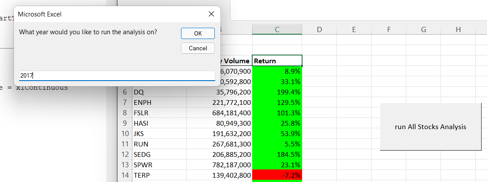
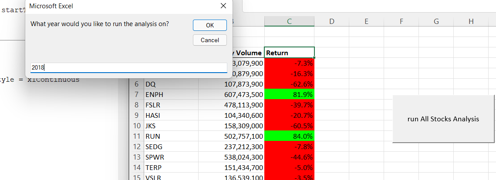
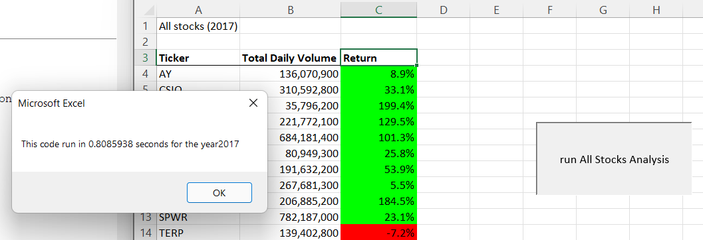
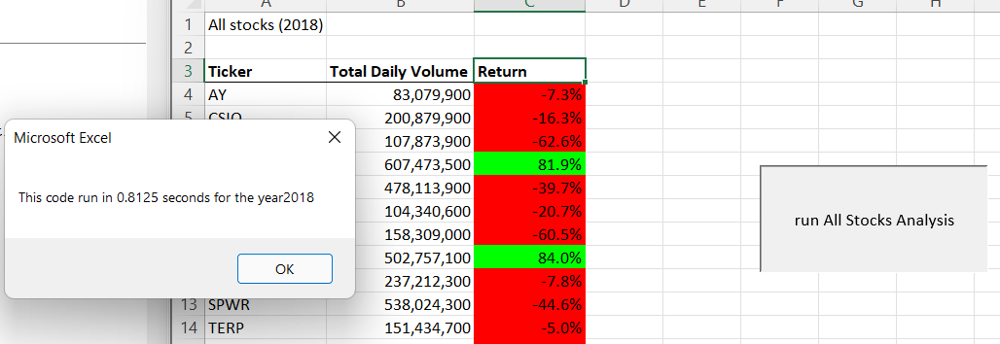

# Stock-Analysis
exploring visual basic for applications

# Overview of Project: 
 # Background 
  Steve loves to analyze an entire dataset at the click of buttun. he asked me to analyze a group of 12 green stocks to support his parents investment decisions.so i designed an interactive, user friedly, workbook using VBA within Excel to provide each stocks annual volume and RIO.
 
 # Purpose
  He wants to analyze a higher number of stocks and this may increase the amount of time it takes the analysis to produce results, so  improving the workbooks efficency by refactoring the VBA coding is so important.
 

# Results: 
# 2017 VS 2018 Stock Prformace
   There is a huge change in 2017 performace of green stocks vs 2018. Two of the 12 stocks,i.e ENPH & RUN produced a positive ROI(return on investment) in both years. most of the stocks also experiences a decline in volume.
 

# Execution time for Original VS Refactored coding
  improving the efficency of the code was a success !!
  improved from 0.9433594 to 0.8085936 in 2017 and 1.066405 to 0.8125 for 2018
# 2017 Original Executin time

# 2017 refactored run time

# 2018 original run time

# 2018 refactored run time

#  Summary:

# What are the advantages or disadvantages of refactoring code?
   # Advantage:
   - The code is short so it uses less memory ,
   - better quality and helps run faster than the origional one.
   - improved code readaability and reduced comlexity.
  # Disadvantage: 
  - if we miss some code it will messedup all the code so we might have to retest lots of functionality.
  - it is time cosuming to compelete the process
  - can be risky when the application is big by introducing bugs
  
# How do these pros and cons apply to refactoring the original VBA script?
  - Refactoring the original VBA is so important to remove code bugs helps programs run faster 
  - it is easier to understand the code,the code bugs slows down the development and is prone to more defects, so it needs  aducate set of unit testes.  
